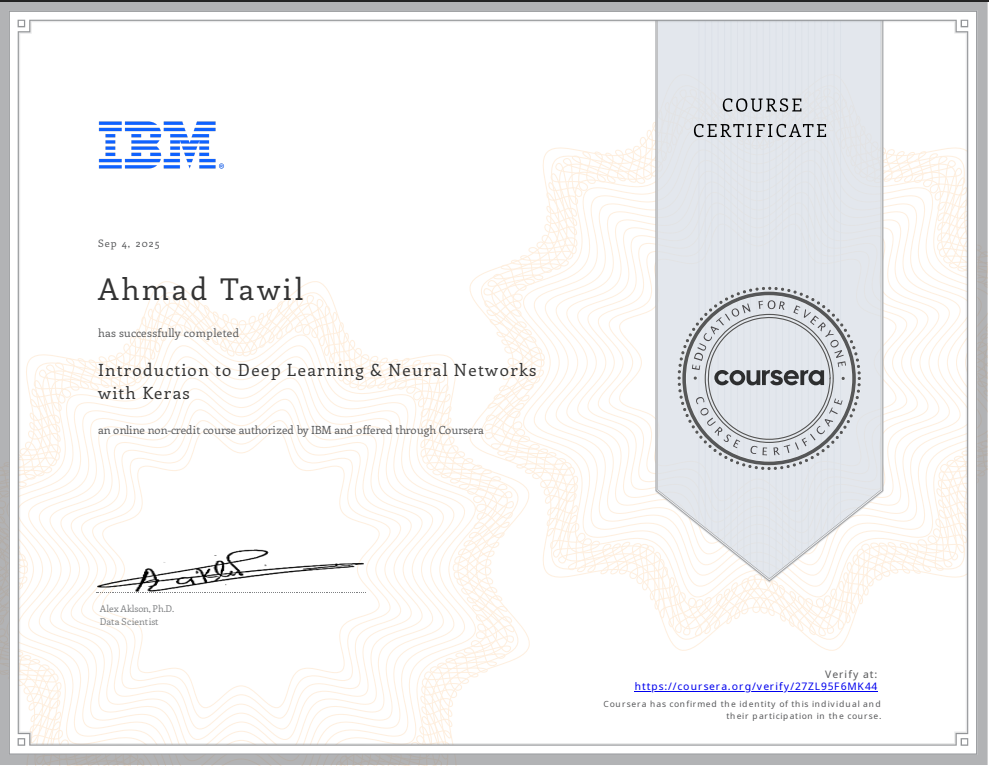

# 🤖 IBM Introduction to Deep Learning & Neural Networks with Keras

## 🎓 Certificate

  
**Provider:** IBM (via Coursera)  
**Verified Certificate:** [View on Coursera](https://coursera.org/verify/27ZL95F6MK44)

---

## 📘 Course Overview
This course is part of the **IBM AI Engineering Professional Certificate** and provides a strong foundation in **deep learning**, focusing on the practical implementation of **neural networks using Keras**.

Topics covered include:
- Fundamentals of artificial neural networks (ANNs)
- Forward and backward propagation
- Gradient descent and optimization
- Activation functions (Sigmoid, ReLU, Softmax, etc.)
- Dealing with vanishing gradients
- Keras Sequential vs Functional API
- Convolutional Neural Networks (CNNs)
- Recurrent Neural Networks (RNNs)
- Transformers
- Autoencoders
- End-to-end projects with image classification and captioning

---

## 🧪 Hands-On Labs & Projects

### **Module 1: Foundations**
- Implemented a simple neural network forward pass manually (NumPy).
- Learned how weights, biases, and activation functions produce outputs.

### **Module 2: Training Neural Networks**
- **Backpropagation Lab:** Solved the XOR problem step-by-step.
- **Activation Functions Lab:** Explored Sigmoid vs ReLU, and vanishing gradient effects.

### **Module 3: Keras Basics**
- Built models using **Sequential** and **Functional API**.
- Applied classification (Car dataset) and regression (Concrete dataset).
- Learned how `.fit()` automates forward/backward propagation.

### **Module 4: Advanced Architectures**
- **CNN Lab:** Implemented image classification with Conv2D, MaxPooling, Flatten, Dense.
- **Transformers Lab:** Implemented self-attention, cross-attention, and transformer blocks.
- **RNNs:** Learned how hidden states retain sequential memory.

### **Module 5: Final Project**
- **Aircraft Damage Classification & Captioning**  
  - Used **VGG16** as a pretrained feature extractor for binary classification (dent vs crack).  
  - Built a **custom Keras layer** integrating **BLIP (Transformer)** for captioning & summarization.  
  - Achieved ~84% test accuracy on classification + generated natural-language summaries.  
  - [Final Project Notebook]((https://github.com/AhmadTawil1/ibm-intro-neuralNetworks-deepLearning/blob/main/module5-final-project/Final_Project_Classification_and_Captioning.ipynb))

---

## 📊 Key Learnings
- Transfer learning with **pretrained CNNs** for efficient classification.
- Building and training models with **Keras** (Sequential & Functional).
- Handling overfitting with **dropout, data augmentation, early stopping**.
- Integrating **transformer-based models** for image captioning.
- Creating **custom Keras layers** with TensorFlow.
- Combining **structured outputs (labels)** with **natural language explanations (captions)**.

---

## 📌 Tools & Libraries
- **TensorFlow & Keras**
- **NumPy & Matplotlib**
- **Hugging Face Transformers**
- **PIL (Image Processing)**

---

- **Issued by:** IBM  
- **Verified by:** Coursera  
- **Credential:** [Verify Certificate](https://coursera.org/verify/27ZL95F6MK44)

---

## 🔗 Next Steps
This course set the stage for:
- **Advanced Deep Learning (CNNs, RNNs, Transformers)**
- **Generative AI** applications
- Integration of deep learning in real-world projects like **Trackr** and **NeuroFocus**

---

## 🏆 Completion
This repository serves as a portfolio-ready record of my work in **Deep Learning with Keras**, demonstrating both foundational understanding and practical implementations through labs and projects.
